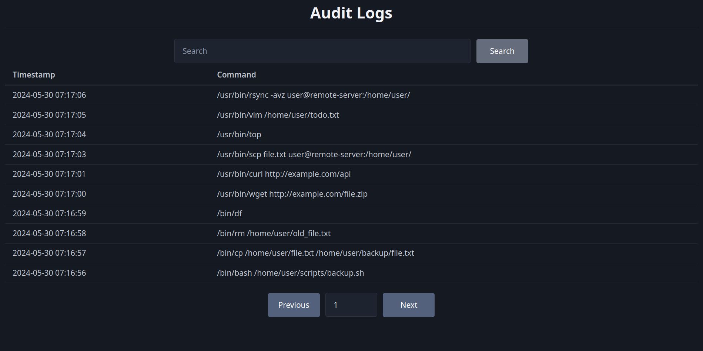

# Auditor

A simple Rust program with a minimal web UI for parsing and displaying Linux audit logs.

## License

This project is licensed under the MIT License. See the [LICENSE](LICENSE) file for details.
